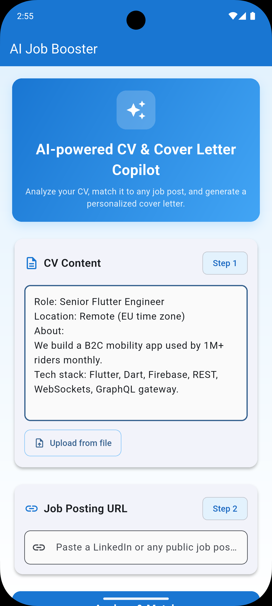
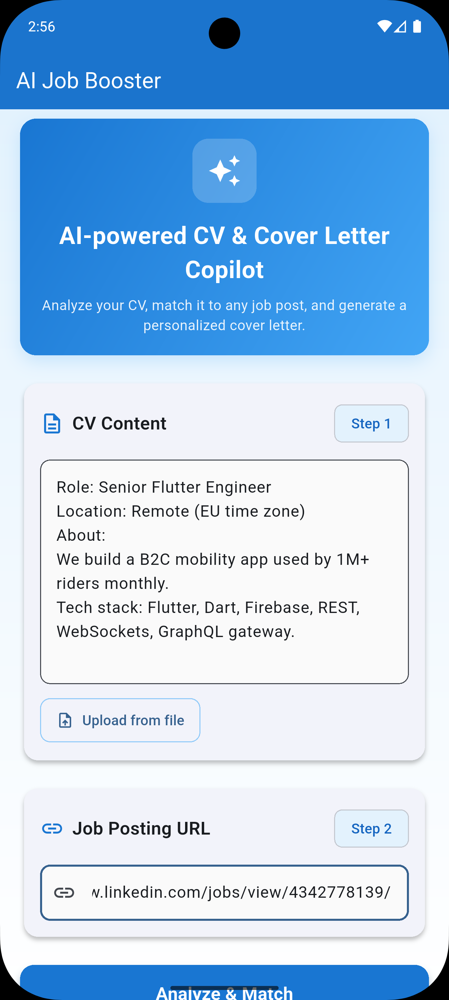
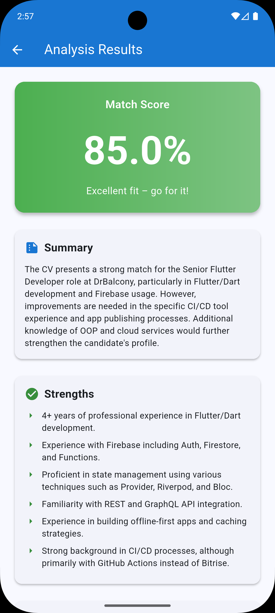
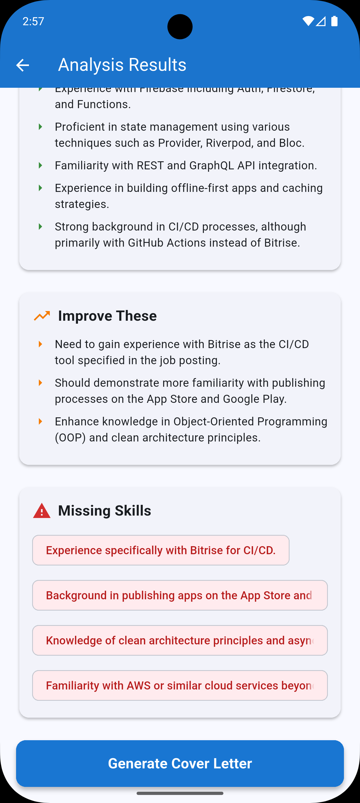
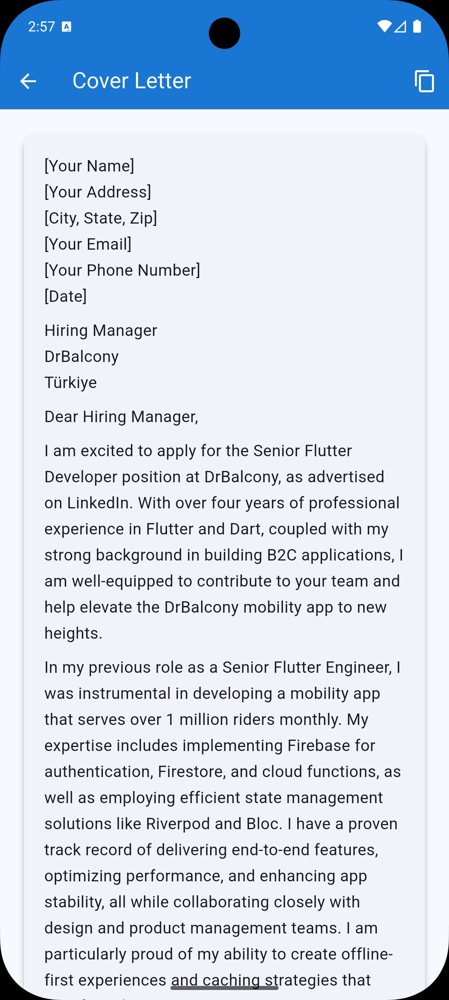

# AI Job Booster: My Journey from Flutter Developer to Full-Stack AI Engineer

## The Beginning: Why I Built This

I've been building Flutter apps for a while. I know how to create beautiful UIs, manage state with Provider, structure code with Clean Architecture, and make apps that users love. But there was always something missing: I could only build apps that worked with local data or simple REST APIs. I had never built my own backend, never integrated AI, and never connected a mobile app to a Python server.

When I completed Week 1 of the LLM Engineering course, I realized I had all the pieces: I knew Flutter, I learned how to use OpenAI's API, and I understood web scraping. But putting it all together—building a complete system from scratch—that was new territory.

**AI Job Booster** became my bridge. It's not just a project; it's my first full-stack application where I learned Python backend development, API design, CORS configuration, and how to make Flutter talk to a real server. This article is the complete story of how I built it, the mistakes I made, the solutions I found, and what I learned along the way.

---

## The Problem: A Real-World Need

Job searching is frustrating. You find a position, but you don't know if you're qualified. You want to write a cover letter, but you don't know what to emphasize. You spend hours tailoring applications, but you're not sure if you're highlighting the right skills.

I wanted to build something that would:
1. **Instantly analyze** how well a CV matches a job posting
2. **Provide actionable feedback** on strengths and gaps
3. **Generate personalized cover letters** that actually work
4. **Work on mobile** so users can analyze jobs on the go

This wasn't just a learning project—it was a real problem I wanted to solve.

---

## Architecture Overview: The Big Picture

Before diving into code, let me explain the architecture. This is crucial because understanding the flow helps you see why each piece exists.

```
┌─────────────────┐
│  Flutter App    │
│  (Mobile UI)    │
└────────┬────────┘
         │ HTTP POST
         │ JSON
         ▼
┌─────────────────┐
│  FastAPI Server │
│  (Python)        │
└────────┬────────┘
         │
    ┌────┴────┐
    │         │
    ▼         ▼
┌────────┐ ┌──────────┐
│Scraper │ │  OpenAI  │
│(BS4)   │ │  API     │
└────────┘ └──────────┘
```

**The Flow**:
1. User enters CV and job URL in Flutter app
2. Flutter sends HTTP POST to FastAPI backend
3. Backend scrapes the job posting using BeautifulSoup
4. Backend sends CV + job posting to OpenAI
5. OpenAI returns structured JSON analysis
6. Backend returns JSON to Flutter
7. Flutter displays results in beautiful UI

This separation is intentional: heavy processing (AI, scraping) happens on the server, keeping the mobile app fast and responsive.

---

## Part 1: Building the Python Backend (My First Real Backend)

### Learning FastAPI from Scratch

I had never written a Python backend before. I knew Python basics, but building an API? That was new. FastAPI was recommended because it's modern, fast, and has automatic documentation.

**My First Endpoint**:

```python
from fastapi import FastAPI

app = FastAPI()

@app.get("/")
def root():
    return {"message": "Hello World"}
```

That was it. I ran `uvicorn app:app --reload` and saw my first API response. But I needed to understand more.

### Understanding CORS: The First Major Hurdle

When I tried to connect my Flutter app to the backend, I got CORS errors. I had no idea what CORS was. After hours of debugging, I learned:

**CORS (Cross-Origin Resource Sharing)** is a security feature that prevents websites from making requests to different domains. Since my Flutter app runs on `localhost` (or emulator IP) and my backend runs on `localhost:8000`, they're considered different origins.

**The Solution**:

```python
from fastapi.middleware.cors import CORSMiddleware

app.add_middleware(
    CORSMiddleware,
    allow_origins=["*"],  # Allow all origins (for development)
    allow_credentials=True,
    allow_methods=["*"],
    allow_headers=["*"],
)
```

This was a breakthrough moment. Suddenly, my Flutter app could talk to my Python backend. I learned that middleware in FastAPI works like a filter—every request goes through it before reaching your endpoints.

### Environment Variables: Keeping Secrets Safe

I learned about `.env` files and why you should never hardcode API keys:

```python
from dotenv import load_dotenv
import os

load_dotenv()
api_key = os.getenv('OPENAI_API_KEY')

if not api_key:
    raise ValueError("OPENAI_API_KEY not found in environment variables")
```

This pattern became crucial. I create a `.env` file with my API key, add `.env` to `.gitignore`, and the code reads it at runtime. Simple, but essential for security.

### Building the Analysis Endpoint: My First Real API

This is where everything came together. Let me walk through the `/api/analyze-job` endpoint step by step:

```python
@app.post("/api/analyze-job")
async def analyze_job(request: JobAnalysisRequest):
    """
    Analyze job posting and CV match
    Returns: match percentage, strengths, areas for improvement
    """
```

**Step 1: Define the Request Model**

I learned about Pydantic models for request validation:

```python
class JobAnalysisRequest(BaseModel):
    cv_content: str
    job_posting_url: str
```

This automatically validates that the request has these fields. If someone sends invalid data, FastAPI returns a 422 error with details. No manual validation needed!

**Step 2: Scrape the Job Posting**

```python
job_content = fetch_website_contents(request.job_posting_url)

if "Error" in job_content:
    raise HTTPException(status_code=400, detail=job_content)
```

I call my scraper function (which I'll explain later). If it fails, I return a 400 error. This was my first experience with proper error handling in APIs.

**Step 3: Craft the AI Prompt**

This is where Week 1's prompt engineering lessons paid off:

```python
system_prompt = """
You are an expert career advisor and recruiter. Analyze the CV and job posting to provide:
1. A match percentage (0-100)
2. Key strengths that match the job requirements
3. Areas that need improvement
4. Specific skills or experiences missing

Respond in JSON format with these keys:
- match_percentage: number
- strengths: array of strings
- improvements: array of strings
- missing_skills: array of strings
- summary: string (brief analysis)
"""

user_prompt = f"""
CV Content:
{request.cv_content[:3000]}

Job Posting:
{job_content[:3000]}

Analyze how well the CV matches the job posting. Be specific and actionable.
"""
```

**Key Decisions**:
- I truncate inputs to 3,000 characters to control costs
- I use structured JSON output so the Flutter app can parse it easily
- I define a clear role in the system prompt

**Step 4: Call OpenAI**

```python
response = openai.chat.completions.create(
    model=MODEL,
    messages=[
        {"role": "system", "content": system_prompt},
        {"role": "user", "content": user_prompt}
    ],
    response_format={"type": "json_object"},
    temperature=0.7
)

result = json.loads(response.choices[0].message.content)
```

**What I Learned**:
- `response_format={"type": "json_object"}` forces JSON output (crucial!)
- `temperature=0.7` balances creativity with consistency
- The response is a complex object; I extract `response.choices[0].message.content`

**Step 5: Return the Response**

```python
return {
    "job_content": job_content[:500],  # Preview for UI
    "analysis": result
}
```

FastAPI automatically converts this Python dict to JSON. The Flutter app receives a clean JSON response.

### The Cover Letter Endpoint: Reusing Patterns

The cover letter endpoint follows the same pattern but with different prompts:

```python
@app.post("/api/generate-cover-letter")
async def generate_cover_letter(request: CoverLetterRequest):
    system_prompt = """
You are a professional career coach helping write compelling cover letters.
Create a personalized, professional cover letter that:
1. Highlights relevant experience from the CV
2. Addresses key requirements from the job posting
3. Shows enthusiasm for the role
4. Is concise (3-4 paragraphs)
5. Is written in a professional but warm tone

Respond with the cover letter text only, no additional commentary.
"""
```

Notice the difference: this prompt asks for natural text, not JSON. The cover letter is meant to be read by humans, so structured output isn't needed.

**Temperature Difference**: I use `temperature=0.8` here (vs. 0.7 for analysis) because cover letters need more creativity and natural language.

### Web Scraping: The Scraper Module

The `scraper.py` file handles fetching job postings. This was my first real web scraping code:

```python
def fetch_website_contents(url):
    """
    Return the title and contents of the website at the given url;
    truncate to 10,000 characters for job postings
    """
    try:
        response = requests.get(url, headers=headers, timeout=10)
        response.raise_for_status()
        soup = BeautifulSoup(response.content, "html.parser")
        title = soup.title.string if soup.title else "No title found"
        if soup.body:
            # Remove irrelevant elements
            for irrelevant in soup.body(["script", "style", "img", "input", "nav", "footer", "header"]):
                irrelevant.decompose()
            text = soup.body.get_text(separator="\n", strip=True)
        else:
            text = ""
        return (title + "\n\n" + text)[:10_000]
    except Exception as e:
        return f"Error fetching website: {str(e)}"
```

**What I Learned**:
- `headers` with User-Agent make requests look like a browser (reduces blocking)
- `timeout=10` prevents hanging on slow sites
- `response.raise_for_status()` throws an error for HTTP errors (4xx, 5xx)
- BeautifulSoup's `decompose()` removes elements entirely (cleaner than just hiding)
- Truncating to 10,000 characters keeps token costs manageable

**The Challenge**: Not all sites work. LinkedIn often requires authentication. Some sites block automated access. I handle this gracefully by returning error messages that the Flutter app can display.

---

## Part 2: Building the Flutter Frontend (My Comfort Zone, But With New Challenges)

### Clean Architecture: Why It Matters

I already knew Clean Architecture from other Flutter projects, but this was the first time I applied it to a full-stack app. The structure:

```
lib/
├── core/
│   └── constants/
│       └── api_constants.dart      # API configuration
├── data/
│   ├── datasources/
│   │   └── job_api.dart            # HTTP calls
│   ├── models/
│   │   ├── job_analysis_model.dart  # Data models
│   │   └── cover_letter_model.dart
│   └── repositories/
│       └── job_repository.dart     # Data layer boundary
└── presentation/
    ├── providers/
    │   └── job_provider.dart       # State management
    └── screens/
        ├── home_screen.dart
        ├── analysis_result_screen.dart
        └── cover_letter_screen.dart
```

**Why This Structure?**
- **Separation of Concerns**: Each layer has one job
- **Testability**: I can mock the repository for tests
- **Maintainability**: Changing the API doesn't break the UI
- **Scalability**: Easy to add features like caching or offline support

### The Data Layer: Making HTTP Calls

The `JobApi` class handles all HTTP communication:

```dart
class JobApi {
  final String baseUrl = ApiConstants.baseUrl;

  Future<JobAnalysisModel> analyzeJob({
    required String cvContent,
    required String jobPostingUrl,
  }) async {
    try {
      final response = await http.post(
        Uri.parse('$baseUrl${ApiConstants.analyzeJobEndpoint}'),
        headers: {'Content-Type': 'application/json'},
        body: jsonEncode({'cv_content': cvContent, 'job_posting_url': jobPostingUrl}),
      );

      if (response.statusCode == 200) {
        return JobAnalysisModel.fromJson(jsonDecode(response.body));
      } else {
        throw Exception('Failed to analyze job: ${response.statusCode}');
      }
    } catch (e) {
      throw Exception('Error analyzing job: $e');
    }
  }
}
```

**Key Points**:
- `jsonEncode()` converts Dart objects to JSON strings
- `jsonDecode()` converts JSON strings to Dart Maps
- I check `statusCode` before parsing (important!)
- Errors are wrapped in `Exception` for consistent handling

**The Base URL Challenge**: This was a major learning moment. Mobile apps can't use `localhost` the same way web apps do:

```dart
class ApiConstants {
  // For Android emulator use 10.0.2.2. For iOS simulator use 127.0.0.1.
  // If testing on a real device, set this to your machine's LAN IP.
  static const String baseUrl = 'http://10.0.2.2:8000';
}
```

- **Android Emulator**: `10.0.2.2` is a special IP that maps to the host machine's `localhost`
- **iOS Simulator**: `127.0.0.1` works directly
- **Real Device**: Need the computer's LAN IP (e.g., `192.168.1.100`)

I spent hours debugging "connection refused" errors before learning this. Now it's documented in the code comments.

### The Repository Pattern: The Clean Boundary

The `JobRepository` acts as a clean boundary between the data source and business logic:

```dart
class JobRepository {
  JobRepository({JobApi? api}) : _api = api ?? JobApi();

  final JobApi _api;

  Future<JobAnalysisModel> analyzeJob({
    required String cvContent,
    required String jobPostingUrl,
  }) {
    return _api.analyzeJob(cvContent: cvContent, jobPostingUrl: jobPostingUrl);
  }
}
```

**Why This Matters**:
- The UI never directly calls `JobApi`; it goes through `JobRepository`
- If I need to add caching, I modify the repository, not the UI
- I can easily swap `JobApi` for a mock in tests
- The constructor allows dependency injection (useful for testing)

This might seem like over-engineering for a simple app, but it's a pattern that scales. As the app grows, this structure pays off.

### State Management: The Provider Pattern

I use Provider for state management. The `JobProvider` class manages all app state:

```dart
class JobProvider with ChangeNotifier {
  final JobRepository _repository;

  JobProvider({JobRepository? repository}) : _repository = repository ?? JobRepository();

  bool _isLoading = false;
  bool get isLoading => _isLoading;

  JobAnalysisModel? _analysis;
  JobAnalysisModel? get analysis => _analysis;

  CoverLetterModel? _coverLetter;
  CoverLetterModel? get coverLetter => _coverLetter;

  String _lastCvContent = '';
  String _lastJobContent = '';

  String? _error;
  String? get error => _error;
```

**State Design Decisions**:
- Private fields (`_isLoading`) with public getters (`isLoading`) for encapsulation
- Nullable types (`JobAnalysisModel?`) because state starts empty
- `_lastCvContent` and `_lastJobContent` cache data for cover letter generation

**The Analysis Method**:

```dart
Future<void> analyzeJob({
  required String cvContent,
  required String jobPostingUrl,
}) async {
  _isLoading = true;
  _error = null;
  notifyListeners();  // UI updates to show loading

  try {
    _analysis = await _repository.analyzeJob(
      cvContent: cvContent,
      jobPostingUrl: jobPostingUrl,
    );
    _lastCvContent = cvContent;  // Cache for later
    _lastJobContent = _analysis?.jobContent ?? '';
  } catch (e) {
    _error = e.toString();
  } finally {
    _isLoading = false;
    notifyListeners();  // UI updates to hide loading
  }
}
```

**Key Patterns**:
- `notifyListeners()` triggers UI rebuilds (Provider magic)
- `try-catch-finally` ensures loading state always resets
- Caching `_lastCvContent` allows cover letter generation without re-entering data
- Errors are stored in `_error`, not thrown (allows UI to display them)

**The Cover Letter Method**:

```dart
Future<void> generateCoverLetter({
  required String cvContent,
  required String jobPostingContent,
  required double matchPercentage,
}) async {
  // ... loading state ...

  try {
    _coverLetter = await _repository.generateCoverLetter(
      cvContent: cvContent.isNotEmpty ? cvContent : _lastCvContent,
      jobPostingContent: jobPostingContent.isNotEmpty
          ? jobPostingContent
          : _lastJobContent,
      matchPercentage: matchPercentage,
    );
  } catch (e) {
    _error = e.toString();
  } finally {
    // ... reset loading ...
  }
}
```

**Smart Defaults**: If `cvContent` is empty, use `_lastCvContent`. This allows generating cover letters from the analysis screen without re-entering data. This UX detail makes the app feel polished.

### The UI Layer: Material Design 3

I used Material Design 3 for a modern, polished look. Let me highlight key UI decisions:

**Home Screen - The Hero Section**:

```dart
Container(
  decoration: BoxDecoration(
    gradient: LinearGradient(
      colors: [Colors.blue.shade700, Colors.blue.shade400],
      begin: Alignment.topLeft,
      end: Alignment.bottomRight,
    ),
    borderRadius: BorderRadius.circular(16),
    boxShadow: [
      BoxShadow(
        color: Colors.blue.shade200.withOpacity(0.4),
        blurRadius: 14,
        offset: const Offset(0, 6),
      ),
    ],
  ),
  // ... content
)
```

**Design Decisions**:
- Gradient creates visual interest
- Shadow adds depth (Material Design principle)
- Rounded corners (16px) feel modern
- Blue color scheme conveys trust and professionalism

**Step Indicators**:

```dart
Chip(
  label: const Text('Step 1'),
  backgroundColor: Colors.blue.shade50,
  labelStyle: TextStyle(color: Colors.blue.shade800),
)
```

These chips guide users through the process. Small detail, big UX impact.

**Analysis Result Screen - Dynamic Color Coding**:

```dart
Color _getColorForPercentage(double percentage) {
  if (percentage >= 70) return Colors.green;
  if (percentage >= 50) return Colors.orange;
  return Colors.red;
}
```

The match score card uses a gradient based on the percentage. Green = good match, orange = moderate, red = needs work. Visual feedback is instant and clear.

**Cover Letter Screen - Markdown Rendering**:

```dart
MarkdownBody(
  data: provider.coverLetter!.coverLetter,
  styleSheet: MarkdownStyleSheet(
    p: const TextStyle(fontSize: 16, height: 1.6),
    h1: const TextStyle(fontSize: 24, fontWeight: FontWeight.bold),
    h2: const TextStyle(fontSize: 20, fontWeight: FontWeight.bold),
  ),
)
```

The cover letter is rendered as Markdown, allowing formatting (bold, paragraphs, etc.) while keeping the backend simple (just returns text).

**Copy to Clipboard**:

```dart
IconButton(
  icon: const Icon(Icons.copy),
  onPressed: () {
    if (provider.coverLetter != null) {
      Clipboard.setData(ClipboardData(text: provider.coverLetter!.coverLetter));
      ScaffoldMessenger.of(context).showSnackBar(
        const SnackBar(content: Text('Copied to clipboard')),
      );
    }
  },
)
```

This small feature makes the app actually useful. Users can copy the cover letter and paste it into email applications.

### Visual Walkthrough

| Home (CV) | Home (Job URL) |
| --- | --- |
|  |  |

| Analysis - Match Score | Analysis - Details |
| --- | --- |
|  |  |

| Cover Letter |
| --- |
|  |

---

## Part 3: The Integration: Making It All Work Together

### The First Connection: Debugging Network Issues

The first time I tried to connect Flutter to the backend, nothing worked. Here's what I learned:

**Problem 1: CORS Errors**
- **Symptom**: Browser console shows CORS errors
- **Solution**: Added CORS middleware to FastAPI (explained earlier)

**Problem 2: Connection Refused**
- **Symptom**: Flutter throws "Connection refused" exception
- **Solution**: Used correct base URL for emulator/simulator (explained in API constants)

**Problem 3: JSON Parsing Errors**
- **Symptom**: App crashes when parsing response
- **Solution**: Added null checks and proper error handling:

```dart
factory JobAnalysisModel.fromJson(Map<String, dynamic> json) {
  final analysis = json['analysis'] as Map<String, dynamic>;
  return JobAnalysisModel(
    matchPercentage: (analysis['match_percentage'] as num).toDouble(),
    strengths: List<String>.from(analysis['strengths'] ?? []),
    improvements: List<String>.from(analysis['improvements'] ?? []),
    missingSkills: List<String>.from(analysis['missing_skills'] ?? []),
    summary: analysis['summary'] ?? '',
    jobContent: json['job_content'] ?? '',
  );
}
```

The `?? []` and `?? ''` provide defaults if fields are missing. This prevents crashes from unexpected API responses.

### Error Handling: User-Friendly Messages

Technical errors aren't user-friendly. I learned to translate them:

```dart
if (provider.error != null) {
  ScaffoldMessenger.of(context).showSnackBar(
    SnackBar(content: Text('Error: ${provider.error}')),
  );
}
```

In production, I'd parse error types and show friendly messages:
- "Connection error" instead of "SocketException"
- "Invalid job URL" instead of "HTTP 400"
- "Server error, please try again" instead of "HTTP 500"

### Loading States: Better UX

Loading indicators prevent user confusion:

```dart
child: provider.isLoading
    ? const SizedBox(
        height: 20,
        width: 20,
        child: CircularProgressIndicator(
          strokeWidth: 2,
          valueColor: AlwaysStoppedAnimation<Color>(Colors.white),
        ),
      )
    : const Text('Analyze & Match'),
```

The button shows a spinner during API calls and disables itself (`onPressed: provider.isLoading ? null : _analyzeJob`). This prevents duplicate requests and gives clear feedback.

---

## Part 4: Challenges and Solutions

### Challenge 1: LinkedIn Scraping Limitations

**The Problem**: LinkedIn often requires authentication or blocks automated access. Simple GET requests fail.

**What I Tried**:
1. Different User-Agent strings
2. Adding cookies
3. Using Selenium (too complex for this project)

**The Solution**: Graceful degradation. If scraping fails, return an error message that the UI can display:

```python
except Exception as e:
    return f"Error fetching website: {str(e)}"
```

Then in the backend:
```python
if "Error" in job_content:
    raise HTTPException(status_code=400, detail=job_content)
```

**Future Improvement**: Use Selenium/Playwright for JavaScript-heavy sites, but that's a bigger project.

### Challenge 2: Token Costs

**The Problem**: OpenAI API costs money. Long CVs and job postings = expensive.

**The Solution**: Truncate inputs:

```python
user_prompt = f"""
CV Content:
{request.cv_content[:3000]}

Job Posting:
{job_content[:3000]}
"""
```

3,000 characters is usually enough for analysis while keeping costs low. I also use `gpt-4o-mini` instead of `gpt-4` (10x cheaper, still excellent results).

### Challenge 3: State Management Complexity

**The Problem**: Managing CV content, job content, analysis results, and cover letters across screens.

**The Solution**: Smart caching in the provider:

```dart
String _lastCvContent = '';
String _lastJobContent = '';

// After analysis
_lastCvContent = cvContent;
_lastJobContent = _analysis?.jobContent ?? '';

// When generating cover letter
cvContent: cvContent.isNotEmpty ? cvContent : _lastCvContent,
```

This allows users to generate cover letters without re-entering data. Small detail, big UX win.

### Challenge 4: Network Configuration

**The Problem**: Different base URLs for emulator vs. real device.

**The Solution**: Clear documentation and comments:

```dart
class ApiConstants {
  // For Android emulator use 10.0.2.2. For iOS simulator use 127.0.0.1.
  // If testing on a real device, set this to your machine's LAN IP.
  static const String baseUrl = 'http://10.0.2.2:8000';
}
```

I also added this to the README with instructions on how to find the LAN IP.

---

## Part 5: What I Learned (The Real Takeaways)

### 1. Backend Development is Different

Coming from Flutter, I was used to everything being in one codebase. Backend development introduced new concepts:

- **API Design**: How to structure endpoints, what to return, error handling
- **CORS**: Why it exists, how to configure it
- **Environment Variables**: Keeping secrets safe
- **Async/Await in Python**: Similar to Dart, but different syntax
- **HTTP Status Codes**: When to use 200, 400, 500, etc.

### 2. Integration is Harder Than It Looks

Connecting Flutter to a backend isn't just "make an HTTP call." You need to:
- Handle network errors gracefully
- Parse JSON correctly (null safety matters!)
- Manage loading states
- Provide user feedback
- Handle edge cases (empty responses, malformed JSON, etc.)

### 3. Clean Architecture Pays Off

Even for a small project, the Clean Architecture structure made everything easier:
- Adding new features was straightforward
- Debugging was easier (know where to look)
- Testing would be simple (mock the repository)
- Code is readable and maintainable

### 4. Prompt Engineering is an Art

The prompts I wrote evolved significantly:
- **First version**: "Analyze this CV and job posting"
- **Final version**: Detailed system prompt with specific output format

The difference in output quality was dramatic. Clear instructions = better results.

### 5. User Experience Details Matter

Small things make a big difference:
- Loading indicators
- Error messages
- Caching data between screens
- Copy to clipboard
- Color-coded match scores

These aren't "nice to have"—they're what makes an app actually usable.

---

## Part 6: Code Walkthrough: The Complete Flow

Let me trace a complete user journey through the code:

### User Journey: Analyzing a Job

**1. User enters CV and job URL in `home_screen.dart`:**

```dart
TextField(
  controller: _cvController,
  maxLines: 8,
  decoration: InputDecoration(
    hintText: 'Paste your CV text here...',
  ),
)
```

**2. User taps "Analyze & Match" button:**

```dart
ElevatedButton(
  onPressed: provider.isLoading ? null : _analyzeJob,
  // ...
)
```

**3. `_analyzeJob()` method is called:**

```dart
Future<void> _analyzeJob() async {
  if (_cvController.text.isEmpty || _jobUrlController.text.isEmpty) {
    ScaffoldMessenger.of(context).showSnackBar(
      const SnackBar(content: Text('Please paste your CV content and a job posting URL.')),
    );
    return;
  }

  final provider = Provider.of<JobProvider>(context, listen: false);
  await provider.analyzeJob(
    cvContent: _cvController.text,
    jobPostingUrl: _jobUrlController.text,
  );
  // ...
}
```

**4. `JobProvider.analyzeJob()` is called:**

```dart
Future<void> analyzeJob({...}) async {
  _isLoading = true;
  _error = null;
  notifyListeners();  // UI shows loading spinner

  try {
    _analysis = await _repository.analyzeJob(
      cvContent: cvContent,
      jobPostingUrl: jobPostingUrl,
    );
    _lastCvContent = cvContent;  // Cache for later
    _lastJobContent = _analysis?.jobContent ?? '';
  } catch (e) {
    _error = e.toString();
  } finally {
    _isLoading = false;
    notifyListeners();  // UI hides loading spinner
  }
}
```

**5. `JobRepository.analyzeJob()` is called:**

```dart
Future<JobAnalysisModel> analyzeJob({...}) {
  return _api.analyzeJob(cvContent: cvContent, jobPostingUrl: jobPostingUrl);
}
```

**6. `JobApi.analyzeJob()` makes HTTP call:**

```dart
Future<JobAnalysisModel> analyzeJob({...}) async {
  final response = await http.post(
    Uri.parse('$baseUrl${ApiConstants.analyzeJobEndpoint}'),
    headers: {'Content-Type': 'application/json'},
    body: jsonEncode({'cv_content': cvContent, 'job_posting_url': jobPostingUrl}),
  );

  if (response.statusCode == 200) {
    return JobAnalysisModel.fromJson(jsonDecode(response.body));
  } else {
    throw Exception('Failed to analyze job: ${response.statusCode}');
  }
}
```

**7. FastAPI receives the request:**

```python
@app.post("/api/analyze-job")
async def analyze_job(request: JobAnalysisRequest):
    # Scrape job posting
    job_content = fetch_website_contents(request.job_posting_url)
    
    # Call OpenAI
    response = openai.chat.completions.create(...)
    
    # Return JSON
    return {"job_content": job_content[:500], "analysis": result}
```

**8. Response flows back through the layers:**

- FastAPI returns JSON
- `JobApi` parses JSON to `JobAnalysisModel`
- `JobRepository` passes it through
- `JobProvider` stores it in `_analysis`
- UI rebuilds (Provider magic)
- User sees results screen

This flow demonstrates the Clean Architecture: each layer has a clear responsibility, and data flows in one direction.

---

## Part 7: Future Improvements and What's Next

### Short-Term Improvements

1. **PDF CV Parsing**: Many users have PDF CVs. I'd use a library like `pdf_text` to extract text.

2. **Better Error Messages**: Parse error types and show user-friendly messages instead of technical exceptions.

3. **Input Validation**: Validate URLs before sending to backend. Check CV length. Provide helpful hints.

4. **History**: Save previous analyses locally using `shared_preferences` or a local database.

### Medium-Term Enhancements

1. **Advanced Scraping**: Use Selenium/Playwright for JavaScript-heavy job boards. This would require a more complex backend setup.

2. **Cover Letter Templates**: Offer different tones (formal, casual, creative). Let users choose before generating.

3. **Multi-Language Support**: Analyze jobs and generate cover letters in different languages.

4. **A/B Testing**: Generate multiple cover letter variations and let users choose the best one.

### Long-Term Vision

1. **Job Recommendations**: Analyze the CV and suggest matching jobs from various sources.

2. **Interview Prep**: Generate potential interview questions based on job requirements.

3. **Salary Insights**: Analyze salary expectations based on skills and experience.

4. **Career Path Suggestions**: Recommend skills to learn for career advancement.

---

## Conclusion: From Flutter Developer to Full-Stack Engineer

This project transformed me from a Flutter developer who only worked with local data to someone who can build complete, full-stack applications. Here's what changed:

**Before**:
- I could build beautiful Flutter UIs
- I could use REST APIs that others built
- I understood mobile development

**After**:
- I can build Python backends with FastAPI
- I can integrate AI into applications
- I understand how mobile apps connect to servers
- I can design APIs
- I understand CORS, environment variables, and backend security
- I can debug network issues
- I can structure full-stack applications

**The Journey**:
- Started with a simple FastAPI endpoint
- Learned CORS the hard way (hours of debugging)
- Built my first real API with multiple endpoints
- Integrated it with Flutter (more debugging!)
- Applied Clean Architecture to a full-stack app
- Learned prompt engineering for real use cases
- Built something that actually works

**The Result**:
A complete, working application that:
- Solves a real problem
- Demonstrates full-stack skills
- Shows AI integration
- Has clean, maintainable code
- Is portfolio-ready

This project isn't just code—it's proof that I can learn new technologies, solve problems, and build complete systems. It's the bridge between "I know Flutter" and "I'm a full-stack developer."

Whether you're a Flutter developer wanting to learn backend development, a Python developer wanting to learn mobile, or someone exploring AI integration, this project shows that you can learn new skills and build something real. Start simple, iterate, learn from mistakes, and keep building.

The code is on GitHub. The article is here. The journey continues.

---

## Technical Specifications

### Backend Stack
- **Framework**: FastAPI 0.109.0
- **Server**: Uvicorn 0.27.0
- **AI**: OpenAI GPT-4o-mini
- **Scraping**: BeautifulSoup4 4.12.3
- **HTTP**: Requests 2.31.0
- **Validation**: Pydantic 2.5.3

### Frontend Stack
- **Framework**: Flutter 3.10+
- **State Management**: Provider 6.1.1
- **HTTP**: http 1.2.0
- **Markdown**: flutter_markdown 0.7.7+1
- **File Picker**: file_picker 10.3.7

### Architecture
- **Pattern**: Clean Architecture
- **Backend**: RESTful API
- **Frontend**: Provider + Repository Pattern
- **Communication**: HTTP/JSON

---

## Resources and Further Learning

- [FastAPI Documentation](https://fastapi.tiangolo.com) - Excellent docs, learned most of what I know from here
- [Flutter HTTP Package](https://pub.dev/packages/http) - Simple HTTP client for Dart
- [Provider Package](https://pub.dev/packages/provider) - State management made simple
- [OpenAI API Documentation](https://platform.openai.com/docs) - Understanding models, prompts, and costs
- [BeautifulSoup Documentation](https://www.crummy.com/software/BeautifulSoup/bs4/doc/) - Web scraping basics
- [LLM Engineering Course - Week 1](https://edwarddonner.com) - Where it all started

---

**Author's Note**: This project represents my journey from mobile-only development to full-stack engineering. Every line of code was a learning experience. Every bug was a lesson. Every feature was a victory. If you're on a similar journey, I hope this article helps. Feel free to fork the code, ask questions, and build something even better.

**License**: Educational purposes. Learn from it, build upon it, create something amazing.
